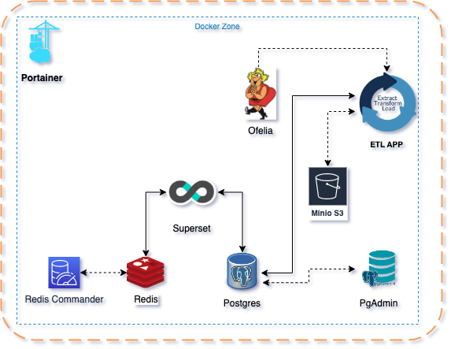

<p align="center">
  A python script to automatically get euro millions values in ETL processing.
  <br>
  
  
  <a href="https://twitter.com/intent/follow?screen_name=mikusher" title="Follow"></a>
  <br>
</p>


## Installation

You can now install it from pypi (the latest version is ) with this command:

```
sudo python3 -m pip install Millennium
```

## Usage

```
$ ./Millennium.py -h                                                                                                  
```

### Project Diagrame
